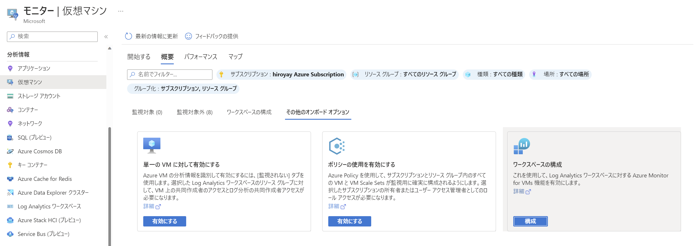
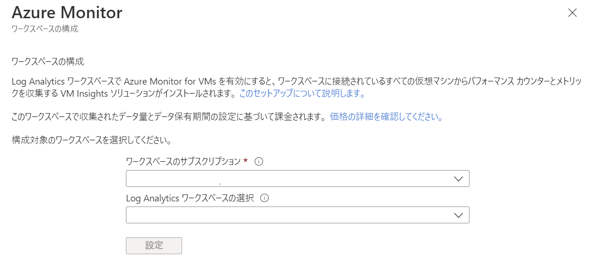
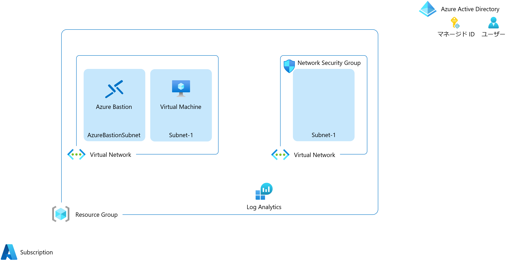

management and security Hands-on lab 
October 2022

 

### 参考情報
- <a href="https://docs.microsoft.com/ja-jp/azure/cloud-adoption-framework/ready/azure-best-practices/resource-naming">名前付け規則を定義する</a>

- <a href="https://docs.microsoft.com/ja-jp/azure/cloud-adoption-framework/ready/azure-best-practices/resource-abbreviations">Azure リソースの種類に推奨される省略形</a>

 

## リソースの展開

 

### パラメーター

- **userAssignedId**: ユーザー割り当てマネージド ID

- **hub-virtualNetwork**: 仮想ネットワーク名 (Hub)

- **hub-addressPrefix**: IPv4 アドレス空間 (Hub)

- **hub-subnetName**: サブネット名 (Hub)

- **hub-subnetPrefix**: サブネット アドレス範囲 (Hub)

- **bastionSubnetPrefix**: AzureBastionSubnet アドレス範囲

- **spoke-virtualNetwork**: 仮想ネットワーク名 (Spoke)

- **spoke-addressPrefix**: IPv4 アドレス空間 (Spoke)

- **spoke-subnetName**: サブネット名 (Spoke)

- **spoke-subnetPrefix**: サブネット アドレス範囲 (Spoke)

- **virtualMachineName**: 仮想マシン名

- **adminUserName**: ローカル管理者

- **adminPassword**: パスワード

- **logAnalyticsWorkspace**: Log Analytics ワークスペース名

※事前にリソースを展開するためのリソース グループの作成が必要

※選択したリソース グループの地域にすべてのリソースが展開

 

## 環境の設定

- ロール割り当てに使用するため Azure Active Directory にアカウントを１つ追加

- VM Insights の既定のワークスペースを設定

  - Azure Monitor の管理ブレードから「**仮想マシン**」-「分析情報の構成**」を選択

  - 「**その他のオンボード オプション**」タブより「**ワークスペースの構成**」をクリック

    

  - サブスクリプションと Log Analytics ワークスペースを選択

    

  - 「**設定**」をクリックして終了

 

